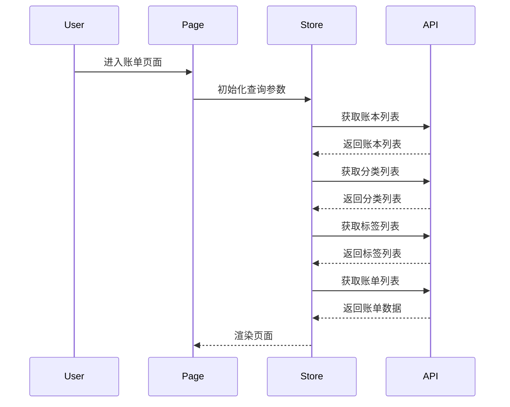
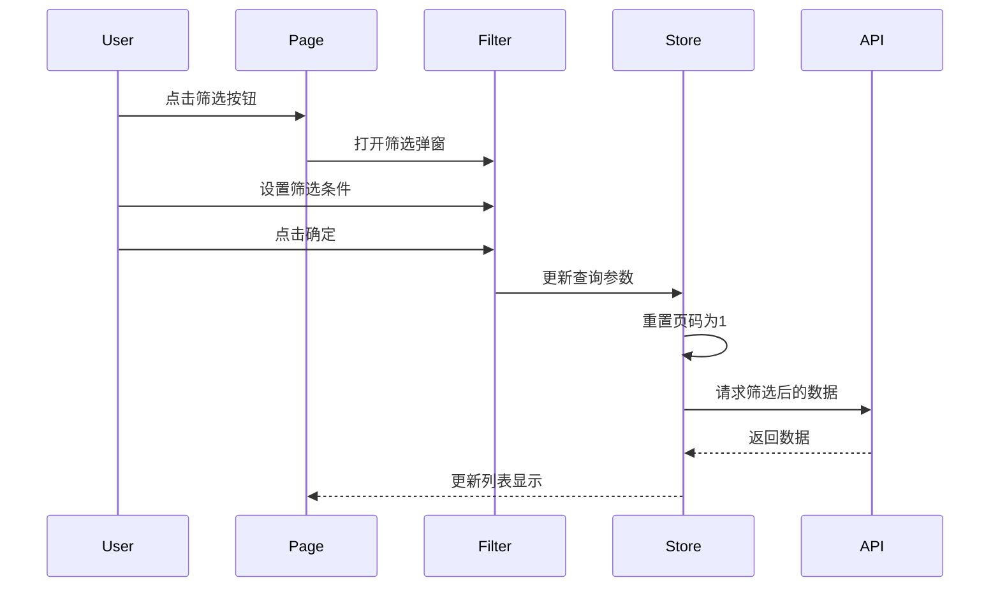
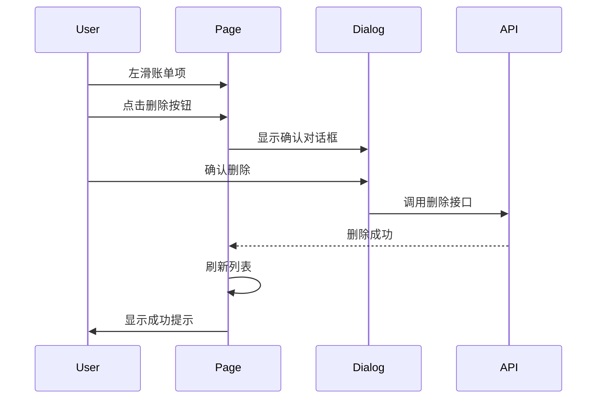

# 账单页面详细设计文档

## 1. 页面概述

### 1.1 页面定位
账单页面是移动端的核心功能页面之一，用于展示用户的收支记录列表，支持按日期分组、筛选查询和快速记账。

### 1.2 页面入口
- 底部 TabBar 第二个 Tab，图标为"账单"
- 路由路径：`/bill-list`

### 1.3 页面类型
一级页面（无顶部导航栏，有底部 TabBar）

---

## 2. 页面布局

### 2.1 整体结构

```
┌─────────────────────────────────────┐
│  筛选栏                              │  ← 固定顶部
│  [本月 ▼] [筛选按钮]                 │
├─────────────────────────────────────┤
│  当月统计卡片                        │
│  支出 ¥1,234.56  收入 ¥5,678.90     │
├─────────────────────────────────────┤
│                                     │
│  日期分组列表（可滚动）              │
│  ┌─────────────────────────────────┐│
│  │ 4月28日 周一                    ││
│  │ ┌─────────────────────────────┐ ││
│  │ │ 🍜 餐饮-早餐    ¥25.00      │ ││  ← 左滑显示删除
│  │ │    早餐备注                  │ ││
│  │ └─────────────────────────────┘ ││
│  │ ┌─────────────────────────────┐ ││
│  │ │ 🚌 交通-公交    ¥2.00       │ ││
│  │ │    通勤                      │ ││
│  │ └─────────────────────────────┘ ││
│  └─────────────────────────────────┘│
│                                     │
│  ┌─────────────────────────────────┐│
│  │ 4月27日 周日                    ││
│  │ ...                             ││
│  └─────────────────────────────────┘│
│                                     │
├─────────────────────────────────────┤
│  悬浮记账按钮（右下角）              │  ← position: fixed
├─────────────────────────────────────┤
│  TabBar                             │  ← 底部固定
└─────────────────────────────────────┘
```

### 2.2 布局参数

| 区域 | 高度 | 说明 |
|------|------|------|
| 筛选栏 | 48px | 固定顶部 |
| 统计卡片 | 80px | 显示当期收支 |
| 列表区域 | 剩余空间 | 可滚动 |
| 悬浮按钮 | 56px | 距底部 76px（TabBar 高度 + 间距） |
| TabBar | 50px + 安全区域 | 底部固定 |

---

## 3. 功能模块设计

### 3.1 筛选栏

#### 3.1.1 布局设计
```
┌─────────────────────────────────────┐
│  [本月 ▼]              [🔍 筛选]    │
└─────────────────────────────────────┘
```

#### 3.1.2 日期快捷选择
点击"本月"弹出 ActionSheet，提供快捷选项：
- 本月
- 本年
- 自定义（弹出日期范围选择器）

#### 3.1.3 筛选按钮
点击"筛选"按钮，弹出底部筛选弹窗（详见 3.4 筛选弹窗）

### 3.2 统计卡片

#### 3.2.1 显示内容
- 当前筛选期间的支出总额（红色）
- 当前筛选期间的收入总额（绿色）

#### 3.2.2 样式规范
```scss
.card {
  padding: 16px;
  background-color: $color-card;
  border-radius: 12px;
  margin: 12px;
}

.expense-amount {
  color: $color-primary;    // #d83d34
  font-size: 20px;
  font-weight: 600;
}

.income-amount {
  color: $color-secondary;  // #00a151
  font-size: 20px;
  font-weight: 600;
}
```

### 3.3 账单列表

#### 3.3.1 数据结构
```typescript
// 按日期分组的数据结构
interface DayGroup {
  date: string;           // "2024-04-28"
  weekday: string;        // "周一"
  dayExpense: number;     // 当日支出
  dayIncome: number;      // 当日收入
  records: IncomeExpense[]; // 当日账单列表
}
```

#### 3.3.2 列表项设计

**布局结构：**
```
┌─────────────────────────────────────┐
│ 🍜  餐饮-早餐                        │  ← 上半部分
│     早餐备注                         │  ← 下半部分
│                          ¥25.00     │  ← 右侧金额
└─────────────────────────────────────┘
```

**显示规则：**
| 字段 | 显示位置 | 样式 |
|------|----------|------|
| 分类图标 | 左侧 | 22px emoji |
| 分类名称 | 左侧上半 | 格式：父分类-子分类，14px，加粗 |
| 备注 | 左侧下半 | 12px，灰色，单行省略 |
| 金额 | 右侧 | 16px，支出红色，收入绿色，带 ¥ 符号 |

**金额显示规则：**
- 支出：红色 `#d83d34`，显示 `¥25.00`
- 收入：绿色 `#00a151`，显示 `¥5,678.90`
- 不显示正负号，仅通过颜色区分

#### 3.3.3 左滑删除

**交互设计：**
1. 用户左滑账单项，右侧露出红色删除按钮
2. 点击删除按钮，弹出确认对话框
3. 确认后删除该条账单

**实现方案：**
使用 Vant 的 `van-swipe-cell` 组件：
```vue
<van-swipe-cell>
  <van-cell-group>
    <!-- 账单内容 -->
  </van-cell-group>
  <template #right>
    <van-button square type="danger" text="删除" />
  </template>
</van-swipe-cell>
```

#### 3.3.4 点击编辑
点击账单项，跳转到记账页面进行编辑，路由：`/record/:id`

### 3.4 筛选弹窗

#### 3.4.1 筛选入口建议

**推荐方案：顶部筛选按钮 + 底部弹窗**

理由：
1. 移动端屏幕空间有限，筛选条件较多，使用底部弹窗可以提供足够的空间
2. 筛选不是高频操作，不需要一直显示在界面上
3. 底部弹窗符合移动端操作习惯，拇指可达区域

#### 3.4.2 弹窗结构
```
┌─────────────────────────────────────┐
│  筛选条件                    [重置] [确定] │
├─────────────────────────────────────┤
│  日期范围                            │
│  [开始日期] 至 [结束日期]            │
├─────────────────────────────────────┤
│  金额范围                            │
│  [最小金额] - [最大金额]             │
├─────────────────────────────────────┤
│  分类筛选                            │
│  ┌────┐ ┌────┐ ┌────┐ ┌────┐       │
│  │全部│ │全部│ │餐饮│ │交通│ ...    │
│  │支出│ │收入│ │    │ │    │       │
│  └────┘ └────┘ └────┘ └────┘       │
├─────────────────────────────────────┤
│  备注搜索                            │
│  [请输入备注关键词]                  │
├─────────────────────────────────────┤
│  标签筛选                            │
│  ┌────┐ ┌────┐ ┌────┐              │
│  │工作│ │生活│ │旅行│ ...          │
│  └────┘ └────┘ └────┘              │
└─────────────────────────────────────┘
```

#### 3.4.3 日期范围筛选

**组件选择：** `van-calendar` 日历组件

**交互设计：**
1. 点击日期输入框，弹出日历选择器
2. 支持选择日期范围
3. 选择完成后自动关闭

**参数处理：**
```typescript
// 开始日期：设置为当天 00:00:00
const beginDate = dayjs(startDate).startOf('day').format('YYYY-MM-DD HH:mm:ss');

// 结束日期：设置为当天 23:59:59
const endDate = dayjs(endDate).endOf('day').format('YYYY-MM-DD HH:mm:ss');
```

#### 3.4.4 金额范围筛选

**组件选择：** `van-field` + `van-stepper` 或自定义输入框

**交互设计：**
1. 两个输入框：最小金额、最大金额
2. 支持小数点后两位
3. 最小金额不能大于最大金额

#### 3.4.5 分类筛选

**设计思路：**
参考 PC 端的树形多选逻辑，适配移动端操作习惯。

**移动端适配方案：**
1. 使用网格布局展示分类
2. 提供"全部支出"、"全部收入"快捷选项
3. 支持多选，选中状态有明显标识

**分类选择器布局：**
```
┌─────────────────────────────────────┐
│  分类筛选                            │
├─────────────────────────────────────┤
│  ┌──────────┐  ┌──────────┐         │
│  │ 全部支出  │  │ 全部收入  │        │
│  │   📌     │  │   📌     │         │
│  └──────────┘  └──────────┘         │
├─────────────────────────────────────┤
│  支出分类                            │
│  ┌────┐ ┌────┐ ┌────┐ ┌────┐       │
│  │🍜  │ │🚌  │ │🏠  │ │🎮  │       │
│  │餐饮│ │交通│ │住房│ │娱乐│       │
│  └────┘ └────┘ └────┘ └────┘       │
│  ┌────┐ ┌────┐ ┌────┐ ┌────┐       │
│  │早餐│ │午餐│ │晚餐│ │零食│       │
│  └────┘ └────┘ └────┘ └────┘       │
├─────────────────────────────────────┤
│  收入分类                            │
│  ┌────┐ ┌────┐ ┌────┐              │
│  │💳  │ │💎  │ │📈  │              │
│  │工资│ │奖金│ │投资│              │
│  └────┘ └────┘ └────┘              │
└─────────────────────────────────────┘
```

**选择逻辑：**
1. 点击"全部支出"：选中所有支出分类（包括顶级和子分类）
2. 点击"全部收入"：选中所有收入分类（包括顶级和子分类）
3. 点击顶级分类：选中该顶级分类及其所有子分类
4. 点击子分类：仅选中该子分类

**传参格式：**
```typescript
// 分类查询参数格式
classifyList: [
  { mainClassifyId: 1, subClassifyId: null },    // 仅顶级分类
  { mainClassifyId: 2, subClassifyId: 5 },       // 指定子分类
  { mainClassifyId: 2, subClassifyId: 6 }
]
```

**组件实现：**
使用自定义组件 `ClassifyFilter.vue`，内部使用网格布局和状态管理。

#### 3.4.6 备注筛选

**组件选择：** `van-search` 或 `van-field`

**交互设计：**
1. 输入框支持模糊搜索
2. 可从常用备注列表中选择
3. 支持清空

#### 3.4.7 标签筛选

**组件选择：** 自定义标签选择器

**交互设计：**
1. 以标签形式展示所有用户标签
2. 点击标签切换选中/取消状态
3. 支持多选
4. 不同标签使用各自的颜色

**传参格式：**
```typescript
// 标签查询参数格式
tagCodes: ["1", "2", "3"]  // 标签 code 数组
```

### 3.5 悬浮记账按钮

#### 3.5.1 位置与样式
```scss
.floating-btn {
  position: fixed;
  right: 16px;
  bottom: calc(66px + env(safe-area-inset-bottom)); // TabBar 高度 + 间距
  width: 56px;
  height: 56px;
  background-color: $color-primary;
  border-radius: 50%;
  box-shadow: 0 4px 12px rgba(0, 0, 0, 0.15);
  display: flex;
  align-items: center;
  justify-content: center;
  color: #fff;
  font-size: 24px;
  z-index: 100;
}
```

#### 3.5.2 点击行为
点击按钮跳转到记账页面 `/record`，新增账单。

---

## 4. 数据交互设计

### 4.1 API 接口

#### 4.1.1 获取账单列表
```typescript
// 接口
POST /incomeExpense/page

// 请求参数
interface IncomeExpenseQuery {
  pageNo: number;
  pageSize: number;
  accountBookId?: number;
  date?: string[];        // [开始日期, 结束日期]
  amount?: number[];      // [最小金额, 最大金额]
  classifyList?: { mainClassifyId: number; subClassifyId: number | null }[];
  remark?: string;
  tagCodes?: string[];
}

// 响应数据
interface PageResult<IncomeExpense> {
  total: number;
  list: IncomeExpense[];
}
```

#### 4.1.2 删除账单
```typescript
DELETE /incomeExpense
// 请求体：账单 ID 数组
[1, 2, 3]
```

### 4.2 数据处理

#### 4.2.1 列表数据分组
```typescript
// 将列表数据按日期分组
const groupByDate = (list: IncomeExpense[]): DayGroup[] => {
  const groups: Record<string, DayGroup> = {};

  list.forEach(record => {
    const date = record.date.split(' ')[0]; // 取日期部分
    if (!groups[date]) {
      groups[date] = {
        date,
        weekday: getWeekday(date),
        dayExpense: 0,
        dayIncome: 0,
        records: []
      };
    }

    groups[date].records.push(record);
    if (record.type === 'EXPENSE') {
      groups[date].dayExpense += record.amount;
    } else {
      groups[date].dayIncome += record.amount;
    }
  });

  return Object.values(groups).sort((a, b) =>
    new Date(b.date).getTime() - new Date(a.date).getTime()
  );
};
```

#### 4.2.2 日期格式化
```typescript
// 获取星期几
const getWeekday = (dateStr: string): string => {
  const weekdays = ['周日', '周一', '周二', '周三', '周四', '周五', '周六'];
  return weekdays[new Date(dateStr).getDay()];
};

// 格式化日期显示
const formatDate = (dateStr: string): string => {
  const date = new Date(dateStr);
  const month = date.getMonth() + 1;
  const day = date.getDate();
  return `${month}月${day}日`;
};
```

### 4.3 状态管理

使用 Pinia Store 管理账单数据：

```typescript
// store/modules/bill.ts
export const useBillStore = defineStore('bill', {
  state: () => ({
    list: [] as IncomeExpense[],
    total: 0,
    loading: false,
    queryParams: {
      pageNo: 1,
      pageSize: 20,
      accountBookId: undefined,
      date: [],
      amount: [],
      classifyList: [],
      remark: '',
      tagCodes: []
    }
  }),

  actions: {
    async loadList(userId: number) {
      this.loading = true;
      try {
        const result = await getIncomeExpenseList(userId, this.queryParams);
        this.list = result.list || [];
        this.total = result.total || 0;
      } finally {
        this.loading = false;
      }
    },

    setQueryParams(params: Partial<typeof this.queryParams>) {
      Object.assign(this.queryParams, params);
    },

    resetQueryParams() {
      this.queryParams = {
        pageNo: 1,
        pageSize: 20,
        accountBookId: this.queryParams.accountBookId,
        date: [],
        amount: [],
        classifyList: [],
        remark: '',
        tagCodes: []
      };
    }
  }
});
```

---

## 5. 组件设计

### 5.1 组件列表

| 组件名 | 路径 | 说明 |
|--------|------|------|
| BillList | views/mobile/bill/index.vue | 账单页面主组件 |
| BillFilter | components/mobile/BillFilter.vue | 筛选弹窗组件 |
| BillItem | components/mobile/BillItem.vue | 账单列表项组件 |
| DayGroup | components/mobile/DayGroup.vue | 日期分组组件 |
| ClassifyFilter | components/mobile/ClassifyFilter.vue | 分类筛选组件 |
| TagFilter | components/mobile/TagFilter.vue | 标签筛选组件 |

### 5.2 BillItem 组件

```vue
<template>
  <van-swipe-cell>
    <div class="bill-item" @click="handleClick">
      <div class="item-icon">{{ icon }}</div>
      <div class="item-content">
        <div class="item-title">{{ classifyName }}</div>
        <div class="item-remark">{{ remark || '-' }}</div>
      </div>
      <div class="item-amount" :class="amountClass">
        ¥{{ formattedAmount }}
      </div>
    </div>
    <template #right>
      <van-button
        square
        type="danger"
        text="删除"
        class="delete-btn"
        @click="handleDelete"
      />
    </template>
  </van-swipe-cell>
</template>

<script setup lang="ts">
import { computed } from 'vue';
import type { IncomeExpense } from '@/types/bill';
import { getClassifyIcon } from '@/utils/classifyIcons';

const props = defineProps<{
  record: IncomeExpense;
}>();

const emit = defineEmits<{
  edit: [record: IncomeExpense];
  delete: [id: number];
}>();

const icon = computed(() => {
  return getClassifyIcon(
    props.record.subClassifyImage || props.record.mainClassifyImage
  );
});

const classifyName = computed(() => {
  const main = props.record.mainClassifyName || '';
  const sub = props.record.subClassifyName;
  return sub ? `${main}-${sub}` : main;
});

const remark = computed(() => props.record.remark);

const amountClass = computed(() =>
  props.record.type === 'EXPENSE' ? 'expense' : 'income'
);

const formattedAmount = computed(() =>
  Math.abs(props.record.amount).toFixed(2)
);

const handleClick = () => emit('edit', props.record);
const handleDelete = () => emit('delete', props.record.id);
</script>
```

### 5.3 BillFilter 组件

筛选弹窗组件，包含所有筛选条件的设置。

**Props:**
```typescript
interface Props {
  visible: boolean;
  accountBooks: AccountBook[];
  classifyList: Classify[];
  tagList: UserTag[];
  remarkList: UserRemark[];
  defaultAccountBookId?: number;
}
```

**Emits:**
```typescript
interface Emits {
  'update:visible': [value: boolean];
  confirm: [filters: FilterParams];
  reset: [];
}
```

---

## 6. 交互流程

### 6.1 页面加载流程



### 6.2 筛选流程



### 6.3 删除流程



---

## 7. 国际化文案

> **注意**：移动端使用独立的国际化文件，命名空间为 `mobile`，文案位于 `locales/mobile/zh-CN.yaml` 和 `locales/mobile/en.yaml`。

### 7.1 中文文案 (locales/mobile/zh-CN.yaml)

```yaml
# 账单页
bill:
  title: 账单
  thisMonth: 本月
  thisYear: 本年
  custom: 自定义
  filter: 筛选
  reset: 重置
  confirm: 确定
  expense: 支出
  income: 收入
  allExpense: 全部支出
  allIncome: 全部收入
  dateRange: 日期范围
  startDate: 开始日期
  endDate: 结束日期
  amountRange: 金额范围
  minAmount: 最小金额
  maxAmount: 最大金额
  classifyFilter: 分类筛选
  remarkFilter: 备注搜索
  remarkPlaceholder: 请输入备注关键词
  tagFilter: 标签筛选
  noData: 暂无账单记录
  deleteConfirm: 确定要删除这条账单吗？
  deleteSuccess: 删除成功
  deleteFailed: 删除失败
  loadFailed: 加载失败
  selectedClassify: 已选择 {count} 个分类
  noRemark: 无备注
  selectDate: 选择日期
  selectClassify: 选择分类
  selectTag: 选择标签
  totalExpense: 支出
  totalIncome: 收入
```

### 7.2 英文文案 (locales/mobile/en.yaml)

```yaml
# Bill Page
bill:
  title: Bills
  thisMonth: This Month
  thisYear: This Year
  custom: Custom
  filter: Filter
  reset: Reset
  confirm: Confirm
  expense: Expense
  income: Income
  allExpense: All Expense
  allIncome: All Income
  dateRange: Date Range
  startDate: Start Date
  endDate: End Date
  amountRange: Amount Range
  minAmount: Min Amount
  maxAmount: Max Amount
  classifyFilter: Category Filter
  remarkFilter: Remark Search
  remarkPlaceholder: Enter remark keyword
  tagFilter: Tag Filter
  noData: No bills yet
  deleteConfirm: Are you sure to delete this bill?
  deleteSuccess: Deleted successfully
  deleteFailed: Delete failed
  loadFailed: Load failed
  selectedClassify: "{count} categories selected"
  noRemark: No remark
  selectDate: Select Date
  selectClassify: Select Category
  selectTag: Select Tag
  totalExpense: Expense
  totalIncome: Income
```

### 7.3 使用方式

在 Vue 组件中使用移动端国际化：

```vue
<template>
  <div class="bill-page">
    <!-- 使用 mobile 命名空间 -->
    <div class="title">{{ t('mobile.bill.title') }}</div>
    <van-button>{{ t('mobile.bill.filter') }}</van-button>
    <span class="expense">{{ t('mobile.bill.expense') }}</span>
    <span class="income">{{ t('mobile.bill.income') }}</span>
  </div>
</template>

<script setup lang="ts">
import { useI18n } from 'vue-i18n';

const { t } = useI18n();
</script>
```

---

## 8. 样式规范

### 8.1 颜色使用

| 元素 | 颜色值 | 用途 |
|------|--------|------|
| 支出金额 | `#d83d34` | 支出金额文字 |
| 收入金额 | `#00a151` | 收入金额文字 |
| 删除按钮 | `#ee0a24` | 左滑删除按钮 |
| 页面背景 | `#f7f8fa` | 页面底色 |
| 卡片背景 | `#ffffff` | 列表项、卡片背景 |
| 主文字 | `#323233` | 标题、金额 |
| 次文字 | `#646566` | 备注、日期 |
| 边框 | `#ebedf0` | 分割线、边框 |

### 8.2 字体规范

| 元素 | 字号 | 字重 |
|------|------|------|
| 日期标题 | 14px | 500 |
| 分类名称 | 14px | 500 |
| 备注文字 | 12px | 400 |
| 金额数字 | 16px | 600 |
| 统计金额 | 20px | 600 |

### 8.3 间距规范

| 元素 | 间距 |
|------|------|
| 页面内边距 | 12px |
| 列表项内边距 | 12px 16px |
| 日期分组间距 | 12px |
| 卡片圆角 | 12px |
| 列表项圆角 | 8px |

---

## 9. 性能优化

### 9.1 列表优化
- 使用 `van-list` 组件实现分页加载
- 滚动到底部自动加载下一页
- 每页加载 20 条数据

### 9.2 缓存策略
- 分类列表、标签列表缓存到 Store
- 账单列表支持下拉刷新

### 9.3 图片优化
- 分类图标使用 emoji，无需加载图片资源

---

## 10. 兼容性说明

### 10.1 iOS 安全区域
```scss
// 底部安全区域
padding-bottom: env(safe-area-inset-bottom);

// 悬浮按钮位置
bottom: calc(66px + env(safe-area-inset-bottom));
```

### 10.2 安卓返回键
- 支持安卓物理返回键
- 筛选弹窗打开时，返回键关闭弹窗而非退出页面
